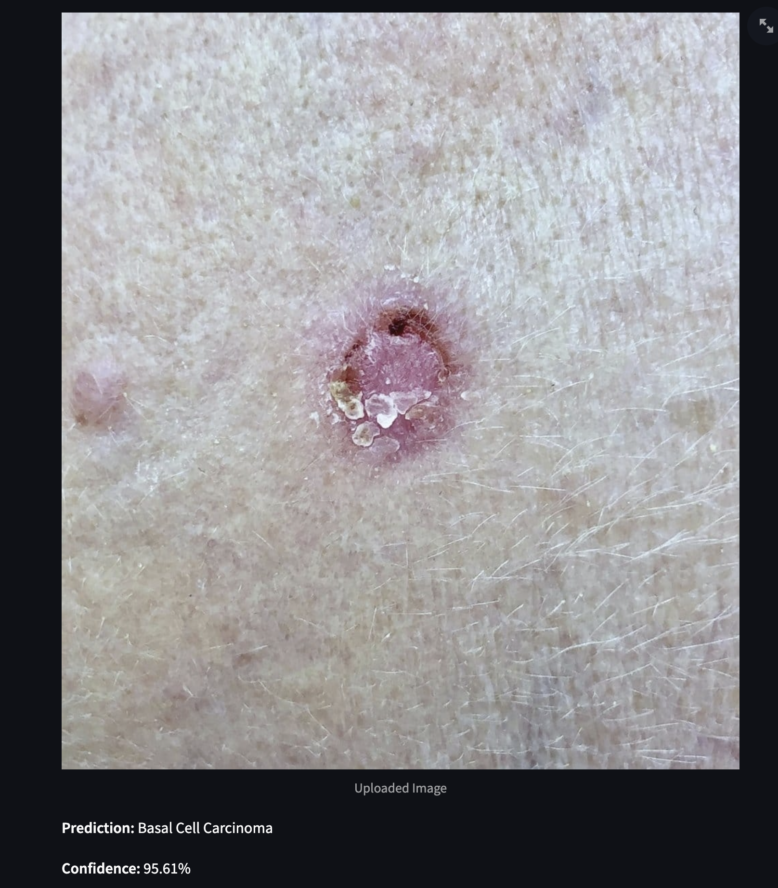

               Skin Disease Prediction                                       

Introduction:
Skin diseases are a significant global health concern, affecting millions of people worldwide. Traditional diagnostic methods, such as visual inspection and biopsies, can be time-consuming and subjective. Recent advancements in artificial intelligence (AI), particularly deep learning, offer a promising solution for improving diagnostic accuracy and efficiency. This project aims to develop a deep learning model using convolutional neural networks (CNNs) to classify skin lesions from dermatological images, assisting dermatologists in early detection and treatment.

Data:
https://www.kaggle.com/datasets/vrindaat/ham10000-dataset - dataset
The project utilizes the HAM10000 dataset, which consists of 10,015 high-resolution images of skin lesions categorized into seven types:
Melanoma (MEL)
Melanocytic nevi (NV)
Basal cell carcinoma (BCC)
Actinic keratoses (AKIEC)
Benign keratosis-like lesions (BKL)
Dermatofibroma (DF)
Vascular lesions (VASC)

Methodology:
Data Preprocessing: Images are resized to 224x224 pixels and preprocessed using rotation, flipping, and zooming to enhance diversity. Pixel values are normalized to the range of 0 to 1.
Model Architecture: The model is based on ResNet50V2, a robust deep neural network architecture enhanced with identity mappings and pre-activation residual blocks. It uses transfer learning with pre-trained ImageNet weights and is fine-tuned on the HAM10000 dataset.
Training: The model is trained using the Adam optimizer with an initial learning rate of 0.001 and categorical cross-entropy loss. It undergoes two phases: initial training with the base model frozen, followed by fine-tuning with selected layers unfrozen.

Execution:
Training Process: The model is trained on the training set with batch size 32 for 10 epochs in each phase.
Validation: The model's performance is monitored on the validation set during training, with early stopping and learning rate reduction based on validation accuracy.
Testing: The final model is evaluated on a separate test set to determine its accuracy.

    
Results:
Training Accuracy: Achieves high accuracy during training, indicating effective learning.
Validation Accuracy: Peaks at a certain epoch, indicating optimal model performance.
Test Accuracy: Provides a measure of the model's generalizability to unseen data.
Metrics: Include accuracy, precision, and recall for each class, offering insights into the model's strengths and weaknesses.
Example results might look like this:
Best Training Accuracy: 89.16%
Best Validation Accuracy: 72.16%
Final Training Accuracy: 89.16%
Final Validation Accuracy: 72.16%
Test Accuracy: 75.08%
These results demonstrate the model's potential for accurate skin lesion classification and its utility in assisting dermatological diagnosis.

https://skin-disease-prediction-svecw.streamlit.app/  - deployment

